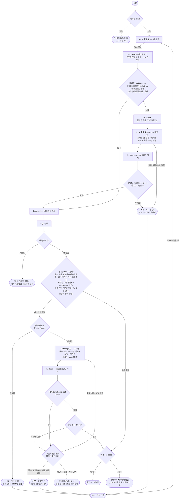

 LLM이 생성한 SQL을 실행해 보면 정답이 아닌 경우가 있다. 이는 결국 잘못된 차트가 그려진다는 의미다. LLM은 태생적으로 확률적(stochastic)이고 비결정적(non-deterministic)이기 때문에, 똑같은 질문을 던져도 틀린 결과를 내는 SQL을 반환하는 경우가 반드시 발생한다. Gemini, Anthropic, OpenAI 등 여러 모델을 대상으로 Text-to-SQL 정확도, 응답 속도, 가격 등을 벤치마크하여 최적의 LLM을 선정했음에도 실제 결과는 실망스러웠다.
 
LLM을 믿고 SQL를 그대로 받아 먹는 구조에서 → LLM을 사용하되 그 결과의 의미를 독립적으로 검증하는 구조로 완전히 프로젝트 방향을 바꿨다. 개발이 아니라 실험이 되었다.
 
 여기서 Claude Code가 작성한 `SQL_VALIDATION_PIPELINE.md` 파일을 공유한다. 이 파일은 본 프로젝트에서 가장 핵심적인 문서이며, 현재도 계속 업데이트되고 있는 워킹(working) 문서다. 나는 이 문서를 기반으로 Claude Code와 소통하며 파이프라인을 개선해 나가고 있다.

---------------------------------------------------------
# SQL 검증 파이프라인

LLM이 만든 SQL이 **캐시에 저장되고 사용자에게 그려지기 전까지** 거치는 세 겹의 안전망을 정리한 문서다. 목적은 하나 — **사용자에게 잘못된 차트를 절대 안 보내고, 잘못된 결과를 캐시에 얼려두지 않는 것.**

캐시 키가 질문 문자열 하나뿐이라, 한 번 잘못된 SQL이 저장되면 그 질문은 캐시를 지울 때까지 **영구히** 같은 오답을 재생한다. 그래서 검증을 **캐시 안쪽**에 둔다 (`_vet_generated_sql`은 `_cached_generate` 내부에서 돈다).

관련 코드: [`app.py`](https://file+.vscode-resource.vscode-cdn.net/Users/song-yunkeun/projects/baseball-chart/app.py) `_cached_generate` → `_vet_generated_sql` → (`_clean_literals`, `validate_sql`, 재생성 repair, `_reroll_if_wrong`).

> **용어 규칙** — 세 단계의 동사를 일부러 분리했다. **clean**(문자열 수리) · **repair**(재생성) · **re-roll**(실행 후 재요청). 코드·로그·grep 어디서도 안 섞이게. "repair"는 오직 B(재생성)만 뜻한다.
> 
> **린트는 A도 B도 아니다** — 세 안전망 사이에 낀 **게이트** `validate_sql`의 일부다. 안전망이 _하는 일_(고친다/다시 묻는다)이라면, 게이트는 _판정_(통과냐 B로 보내냐)만 한다. 자세히는 [아래 `validate_sql` 절](https://file+.vscode-resource.vscode-cdn.net/Users/song-yunkeun/projects/baseball-chart/docs/SQL_VALIDATION_PIPELINE.md#validate_sql--%EA%B2%8C%EC%9D%B4%ED%8A%B8-a%EC%99%80-b-%EC%82%AC%EC%9D%B4%EC%9D%98-%ED%8C%90%EC%A0%95-%EB%A6%B0%ED%8A%B8%EA%B0%80-%EC%82%AC%EB%8A%94-%EA%B3%B3).

---

## 세 안전망 한눈에

|#|단계|함수|무엇을 잡나|방식|LLM 재요청?|재요청도 실패하면|
|---|---|---|---|---|---|---|
|**A**|리터럴 수리 (clean)|`_clean_literals` → `clean_corrupted_literals`|깨진 문자열 리터럴 (`'\n이숭용'`, NFD 한글, `\uXXXX` 잔재)|코드가 조용히 손봄|❌ 안 함|해당 없음 — 재요청 자체가 없음|
|**B**|재생성 (repair)|인라인 (`_generate_in_thread(repair=…)`)|**SQL이 안 돎** — 문법·컬럼 오류, 린트 위반|오류 메시지를 LLM에 되먹여 재생성|✅ 재생성|**거부**|
|**C**|실행 후 검사 (re-roll)|`_reroll_if_wrong`|**값이 틀림** — 불가능 rate·통산 차등 불일치(rate + 카운팅)·시즌별 차등 불일치, 그리고 **명단이 틀림** — 손잡이 필터 누출 (빈 결과는 트리거 아님)|재요청. 가드가 재검증할 수 있으면 진단값을 알려주고, 없으면 질문만|✅ 재요청 (단, 값 문제인데 5,000행 초과면 **안 부르고 바로 거부**)|**값이 틀리면 거부 · 손잡이 누출 단독이면 그대로 응답**|

> **두 컬럼을 나눈 이유** — `LLM 재요청?`은 그 단계가 LLM을 다시 부르는가(A는 코드만, B·C는 부름), `재요청도 실패하면`은 그 재요청까지 했는데도 **못 고쳤을 때**의 결말이다. A는 재요청 개념 자체가 없어 "실패"가 성립하지 않는다.
> 
> **빈 결과는 2026-08-07부터 C의 트리거가 아니다.** 그대로 응답하고 **캐시에는 넣지 않는다** (`_UncachedResult`). 원래는 빈 결과가 리터럴 손상의 징후라고 보고 재요청을 샀는데, 두 가지가 그 근거를 없앴다. 첫째, 2026-08-06부터 A(`_clean_literals`)가 세 응답 전부를 세척하면서 그 손상을 결정론적으로 처리한다. 둘째, 전체 로그 실측에서 **빈 결과 재요청 1,430건 중 회복 172건이 전부 픽스처 `이숭용 팀 이적 히스토리` 하나**였고, 실제 질의 33개 기준 회복률은 **0%**였다(그 사이 52%는 아예 돌지도 않는 SQL을 받아왔다).
> 
> **캐시에 넣지 않는 것이 재요청을 뺄 수 있게 한 조건이다.** 빈 답을 캐시하던 것이 바로 한 번의 불운한 롤을 그 질문의 영구 막다른 길로 만들던 원인이고, 그래서 자동 재요청이 유일한 탈출구였다. 이제 사용자가 "데이터가 있어야 하는데" 싶으면 다시 물어서 진짜 새 생성을 받을 수 있다.

**핵심 구분** — B는 _"실행 가능성"_(SQL이 도는가), C는 _"값 정확성"_(값이 맞는가)을 본다. A는 이 둘이 구조적으로 못 잡는 문자열 깨짐을 앞단에서 조용히 씻어낸다.

**C 안에서 결말이 갈리는 이유** — C의 트리거 넷 중 셋은 **값**을 문제 삼고 하나는 **명단**을 문제 삼는다. 틀린 값은 평범해 보이면서 엉뚱한 선수를 줄세우므로 내보낼 수 없다. 반면 손잡이 누출은 스위치타자 한 명이 "왼손타자 제외" 목록에 남는 것이고, 이 앱이 기록한 누출 11건이 전부 그 한 사례다 (스위치타자는 타자의 1.9%이며, 좌/우 이분법에서 스위치를 어디에 넣을지는 출처마다 갈리는 관례다). 그래서 2026-08-08부터 손잡이 누출 **단독**으로는 거부하지 않는다 — 재요청은 그대로 하되, 그래도 안 풀리면 차트를 내보낸다. 흠 하나 때문에 방문자에게서 답 전체를 빼앗는 쪽이 더 큰 손해다.

**이 표에 "린트"라는 행이 없는 이유** — 린트는 안전망이 아니라 A와 B **사이의 게이트** (`validate_sql`)의 일부다. 스스로 아무것도 고치지 않고 "이 SQL은 틀렸다"고 판정해 **B를 발동시킬 뿐**이라, B행의 "무엇을 잡나" 칸에 _린트 위반_으로만 나타난다.

---

## 공식은 어디 사는가 — 생성 층과 검증 층

rate 공식은 이 리포에 **두 벌** 있고 역할이 정반대다. 둘 다 `queries.py`에 있어 섞어 읽기 쉬운데, 하나는 SQL을 **만들 때** 쓰이고 다른 하나는 그 SQL을 **검사할 때** 쓰인다.

|층|무엇|어디|누가 쓰나|
|---|---|---|---|
|**생성**|rate 매크로 7종 (`ops` `obp` `slg` `ba` `iso` `era` `whip`)|`queries.py` `_RATE_MACRO_SQL`|**LLM이 만든 SQL이 호출한다.** 공식이 매크로 안에 한 번만 있으므로 조립을 틀릴 수 없다|
|**검증**|단순 rate 5종 (OPS/OBP/SLG/AVG/ERA)|`queries.py` `_CANON_RATE`|C의 차등 가드가 잣대로 실행|
|**검증**|카운팅 스탯 (HR/H/G/W/SV…)|`queries.py` `_COUNT_TABLES`|같음. 공식이 아니라 "전 시즌 합계를 초과하나"라는 단방향 부등식이다|
|**검증**|+stat (OPS+ / ERA+)|**`canonical_sql.py`** — `_CANON_PLUS` / `_CANON_PLUS_SEASON`이 참조|같음. SQL 상수 4개 = 스탯 2 × 그레인 2|

**매크로가 위 세 안전망 표에 없는 이유** — 매크로는 안전망이 아니라 A보다 **앞**에 있다. 안전망은 이미 만들어진 SQL을 고치거나(A) 다시 묻지만(B·C), 매크로는 틀린 SQL이 만들어지는 경로 자체를 없앤다. 잡는 쪽이 아니라 못 일어나게 하는 쪽이라 표의 어느 칸에도 안 들어간다. 그래서 이 문서에서 매크로가 등장하는 세 곳은 전부 검증 문맥이다 — 린트의 검사 대상(인자 순서), 허용오차 절의 동등 재작성 항목, 그리고 실측 12번의 A/B.

**잣대는 매크로를 호출하지 않는다.** `_CANON_RATE`도 `canonical_sql.py`도 공식을 펼쳐 쓴다. 잣대와 피검사자가 같은 코드를 공유하면 그 코드가 틀어졌을 때 둘이 사이좋게 같이 틀린다. `_CANON_RATE`를 "매크로와 중복이니 매크로 호출로 정리하자"고 바꾸면, **매크로가 틀어진 경우를 차등이 영영 못 본다.**

**+stat만 별도 파일인 이유** — `canonical_sql.py`는 프로덕션 가드(`queries.py`)·pytest· `eval/harness.py` 셋이 공유한다. 원래 `tests/` 안에 있었으나 프로덕션이 참조하게 되면서 리포 루트로 올라왔다(프로덕션 코드가 테스트 디렉터리를 import할 수는 없다). 통산과 시즌별을 두 벌로 두는 것은 통산 +stat이 선수의 시즌들을 PA/IP로 가중평균한 **다른 통계**여서, 통산 SQL로 시즌 결과를 검사하면 정상 차트를 거부하기 때문이다.

**커버리지는 스탯마다 다르다.** 매크로가 7종이라고 7종이 다 검사되는 것은 아니다.

|스탯|매크로|천장 (`mis_aggregated_rate`)|차등 (`_CANON_RATE`)|
|---|---|---|---|
|OPS · OBP · SLG · AVG(`ba`)|✅|✅|✅|
|ERA|✅|— (상한이 없는 스탯)|✅|
|ISO|✅|✅|❌|
|WHIP|✅|❌|❌|
|BABIP|❌|✅|❌|

빈 칸은 그 스탯의 리더보드가 값 검사 **없이** 나간다는 뜻이다. 같은 종류의 공백이 통산 홈런에서 실제로 드러났고(아래 C 절의 카운팅 스탯 박스), 그것을 메운 것이 `_COUNT_TABLES`다. WHIP과 ISO는 아직 그 상태다 — 매크로가 공식을 고정하므로 조립 실수는 못 일어나지만, fan-out처럼 매크로 바깥에서 생기는 결함은 잡을 것이 없다.

---

## 순서도



> **LLM 호출은 최대 3회.** ①1차 생성 + ②B의 repair + ③C의 재요청. B와 C는 배타적이지 않다 — repair가 성공해도 그 결과는 C를 다시 통과해야 하므로, 둘 다 발동하면 재요청이 2번(총 3회)이다. 빈 결과는 어느 재요청도 사지 않는다.

---

## 단계별 상세

### 진입 — `_cached_generate`

1. `_generate_in_thread(query)`로 1차 생성 (60초 타임아웃, 데몬 스레드라 중단 가능)
2. `result.error`면 → **raise** (캐시 안 함). LLM 레벨 오류·타임아웃이 여기.
3. 아니면 → `_vet_generated_sql(result, query)`로 넘김
4. 통과한 SQL을 전 기간으로 한 번 실행해 **캐시에 넣을 자격**을 본다 (캐시 미스에서만, ~23ms):
    - **빈 결과** → `_UncachedResult` (응답하되 캐시 안 함)
    - **5,000행 초과** → `_UncachedResult` (응답하되 캐시 안 함 — 어차피 `_charted`가 거부한다)

> **캐시에 들어가는 것은 차트가 된 응답뿐이다.** 규칙을 하나로 유지하려고 상한 초과도 여기서 뺀다 (2026-08-11). 이전에는 값 가드가 걸린 상한 초과는 `.error`라서 캐시에 안 들어가고, 값이 멀쩡한 상한 초과는 캐시에 들어가 — 같은 상황이 두 갈래로 갈렸다. 캐시에는 `ttl`도 `max_entries`도 없으므로, 그리지 못하는 응답 하나가 프로세스가 사는 내내 남는다.
> 
> 화면에 보이는 것은 달라지지 않는다. 거부 문구는 그대로 `_charted`가 쓰고, **방문자가 보고 있는 연도 범위**의 행 수를 센다 — 여기서 센 전 기간 행 수보다 작을 수 있다. 대가는 같은 넓은 질문을 또 물었을 때 생성을 한 번 더 쓰는 것인데, 그리지도 못하는 질문을 반복하는 방문자는 없다.

### A. 리터럴 수리 (clean) — `_clean_literals` (LLM 응답마다 실행)

- 깨진 게 **있든 없든 매번** 한 번 훑는다. 없으면 아무것도 안 바꾸고 통과.
- 결정론적(코드가 직접 고침, LLM 없음, 마이크로초).
- **왜 검증보다 앞이냐** — 여러 이름 중 하나만 깨지면 SQL이 **에러 없이 그냥 행을 반환**한다 (`WHERE Player IN ('이승엽', '\n양준혁')` → 양준혁만 조용히 빠짐). 검증도 통과하고 C도 안 걸리니, 검증 뒤에 두면 **구조적으로 못 잡는다.**
- 로그: `Cleaned SQL literals for …` — "repair"가 아니라 **"Cleaned"**로 찍는다(의도적).
- **세 LLM 호출 전부에 걸린다** (1차 생성 · B의 repair · C의 재요청). 2026-08-06까지는 1차 생성에만 걸려 있었다 — 손상은 비결정적이라(`'\t선동열'`이 3회 중 1회) **어느 호출에든** 내려앉을 수 있는데, repair와 재요청의 SQL은 씻지 않은 채 `validate_sql`로 직행했다. 그리고 `validate_sql`은 리터럴이 아무것과도 안 맞는 쿼리를 기꺼이 통과시킨다. C 쪽이 더 얄궂었다 — **일시적 텍스트 깨짐을 씻는 것이 C의 명시적 목적인데** 정작 씻는 단계를 안 거치고 "이번엔 안 깨지겠지"에 기대고 있었다. 지금은 `_generate_and_clean`이 LLM 응답이 들어오는 **단일 지점**에서 씻는다 — 호출부마다 거는 대신 한 곳으로 모아서, 네 번째 호출이 생겨도 빠뜨릴 수 없게 했다.

### `validate_sql` — 게이트 (A와 B 사이의 판정, 린트가 사는 곳)

A와 B 사이에 낀 **판정 지점**이지 안전망이 아니다. 스스로 고치지도(A) 다시 묻지도(B·C) 않고, "통과 / B로" 둘 중 하나만 정한다. **린트가 여기 산다** — 그래서 세 안전망 표에 린트라는 행이 없다.

[`queries.py`](https://file+.vscode-resource.vscode-cdn.net/Users/song-yunkeun/projects/baseball-chart/queries.py) `validate_sql`는 세 검사를 **순서대로** 돌리고, 하나라도 걸리면 그 메시지를 반환한다 (반환값 = 그대로 B가 LLM에 되먹이는 오류 텍스트):

|#|검사|무엇을 보나|걸렸을 때|
|---|---|---|---|
|1|`_blocked_reason`|SELECT가 아닌 SQL (INSERT·DROP 등)|즉시 거부|
|2|**`lint_sql`**|**증명 가능하게 틀린 구조** — SLG 빠진 OPS, 리그 기준선 필터 누출, raw rate 컬럼 직접 사용, 매크로 인자 순서, 명시된 최소 기준 무시 등|→ **B**|
|3|`_run_sql` (DuckDB)|문법·컬럼 오류 — 실제로 한 번 실행해봄|→ **B**|

- 통과(셋 다 무사) → **C로** (`_reroll_if_wrong`)
- 판정은 전 연도 범위 기준(슬라이더와 무관 — 실패의 98%는 구조 오류라 범위를 안 탄다).
- 순서가 중요하다: 텍스트 검사 둘은 마이크로초, 실행은 ~23ms. 린트에 걸릴 SQL은 어차피 B로 갈 거라 DuckDB 왕복을 살 이유가 없다.

#### 린트 ≠ clean — 헷갈리기 쉬운 지점

||**A. clean** (`clean_corrupted_literals`)|**린트** (`lint_sql`)|
|---|---|---|
|어디|안전망 A|게이트 `validate_sql` 안 (2번)|
|무엇을|깨진 **문자열 리터럴** (`'\n이숭용'`, NFD 한글)|증명 가능하게 틀린 **SQL 구조**|
|무엇을 하나|**고친다** — 코드가 조용히 수리하고 계속 진행|**고치지 않는다** — 왜 틀렸는지만 돌려주고 B로 넘김|
|LLM|안 부름|자기는 안 부르지만, **B를 발동시킨다**|
|로그|`Cleaned SQL literals`|`Refusing provably-wrong SQL` (B까지 실패했을 때)|

한 줄 요약: **clean은 수리공, 린트는 검사관.** 검사관은 불합격 사유를 적어줄 뿐이고, 그 사유를 들고 다시 만드는 건 B다.

### B. 재생성 (repair) — SQL이 안 돌 때만

- `_generate_in_thread(query, repair=(깨진 SQL, 오류 상세))` — **오류를 LLM에 되먹여** 다시 생성.
- 세 결말:
    
    |결과|로그|다음|
    |---|---|---|
    |호출 실패 / SQL 없음|`Repair call failed`|→ 거부|
    |재검증 또 실패|`Repaired SQL still broken`|→ 거부|
    |재검증 통과|`Repaired SQL for`|→ **C로**|
    
- **중요**: repair가 성공해도 곧장 안 내보낸다. _"repair는 SQL이 돈다는 것만 증명하지 값이 맞다는 건 아니다."_ 그래서 **B 결과도 C(실행 후 검사)을 똑같이 통과**해야 한다. (10롤 테스트에서 한 롤이 이 경로로 선동열 ERA+ 347.2를 냈는데 — 정답 300.6 — C가 안 돌면 그대로 나갈 뻔했다.)

#### 되먹이는 메시지는 규칙이 아니라 **위치**를 말해야 한다 (2026-08-10 실측)

B의 성공률은 되먹이는 문장에 달려 있고, 그 문장이 일반 규칙이면 모델은 엉뚱한 데를 고친다. `통산 OPS+ 탑 10 스위치타자만`이 이 앱 최대 ERROR 덩어리(`flagged.jsonl` 6건)였던 이유가 이것이다. 모델은 `player_season` CTE에서 OBP/SLG를 **정확히 올바르게** 계산해 놓고, 다음 CTE에서 `FROM kbo_batting p`로 바인딩해 원시 `p.OBP`를 읽었다. 그런데 린트 메시지는 "원시 컬럼 대신 매크로를 쓰세요"라고만 했다 — **모델이 이미 한 일**이고, 틀린 한 지점(`p`의 바인딩)은 한 글자도 없었다.

입력을 고정한 repair 프로브(같은 SQL·같은 메시지로 repair 호출만 N롤, `working/repair_probe.py`):

|되먹인 문장|온도|고침|같은 결함 재발|다른 실패|
|---|---|---|---|---|
|일반 규칙만|0.1|7/10|3|0|
|일반 규칙만|0.3|6/10|1|3|
|**결함 위치를 지목**|0.1|**20/20**|0|0|

실패 모드가 원인을 알려줬다. 온도 0.3의 "다른 실패" 셋은 전부 컬럼 이름만 `OBP_raw`로 바꾸고 바인딩은 그대로 둔 `Binder Error`다 — 불평을 "이름 문제"로 알아들은 것이다. 온도는 늪을 얕게 만들 뿐(같은 결함 3→1) 다른 걸 깨뜨려(0→3) 순 성공은 오히려 줄었다. **레버는 온도가 아니라 메시지였다.**

그래서 린트에 규약이 하나 생겼다: **검출기는 `True` 대신 문자열을 돌려줄 수 있고, `lint_sql`이 그것을 공용 안내 앞에 붙인다.** 스코프 해석이 이미 알아낸 사실(어느 참조가 어느 테이블로 resolve 되는지)을 버리지 않고 그대로 싣는다. 현재 `_lint_raw_rate_column`만 이 규약을 쓰고 나머지 아홉은 bool이다 — repair 성공률이 낮은 린트부터 옮기면 된다.

이 레버가 특히 값진 이유는 **시스템 프롬프트가 아니기 때문**이다. 프롬프트 수정은 무관한 질의를 깨뜨리지만(아래 실측), 실패별 메시지는 그 실패에만 보인다.

### C. 실행 후 검사 (re-roll) — `_reroll_if_wrong`

**빈 결과는 트리거가 아니다** (2026-08-07). 함수 이름도 그에 맞춰 `_reroll_if_empty_or_wrong` 에서 바꿨다 — 이름이 하는 일과 어긋나면 주석으로 덮지 않고 이름을 고친다. 트리거는 넷이고, 앞의 셋은 "값이 틀렸다", 마지막 하나는 "명단이 틀렸다"이다. **재요청으로도 못 고쳤을 때 거부하는 것은 값 셋뿐이다**:

|트리거|함수|뜻|재요청도 실패하면|
|---|---|---|---|
|불가능 rate|`mis_aggregated_rate`|물리적 불가 (SUM(OPS) 굴려 career OPS ~15)|거부|
|통산 차등 불일치|`differential_mismatch`|그럴듯한데 틀림 (SLG 빠진 OPS = 사실 OBP ~0.4). **카운팅 스탯은 전 시즌 합계 초과** (중복 집계)|거부|
|시즌별 차등 불일치|`season_differential_mismatch`|같은 재계산을 `(Id, Season)`로 (연도별 추이·에이징 커브)|거부|
|이름 기반 카운팅 초과|`counting_exceeds_name_total`|`Id`가 없는 결과(`연도별 홈런 1위`)의 카운팅 값이 그 이름의 최대 합계를 넘음|거부|
|손잡이 필터 누출|`handedness_filter_leak`|질문이 건 필터가 결과에 안 걸림 ("왼손타자 제외"인데 스위치가 남음)|**응답**|

> **카운팅 스탯은 2026-08-11에 같은 차등 가드 안으로 들어왔다.** 그전까지 `통산 홈런 탑 10`은 **네 가드 전부를 그냥 통과했다** — 가드가 모두 rate를 키로 삼기 때문이다(불가능 rate는 rate 컬럼이 없어 skip, 차등 둘은 `_CANON_RATE`에만 걸려 skip, 손잡이는 해당 없음). 이 앱이 가장 많이 받는 모양에 런타임 검사가 0개였고, 골든 스냅샷이 CI에서 같은 모양을 통째로 고정하는 동안 프로덕션은 아무것도 보지 않았다.
> 
> **이 검사는 rate 대조에서 허용오차만 뺀 것이 아니라 단방향이다.** 결과값이 그 선수의 전 시즌 합계를 **초과**할 때만 걸린다. 어떤 부분집합(한 팀·한 시대·규정타석 시즌만)을 집계했든 부분은 전체보다 클 수 없으므로 초과는 의심이 아니라 **산술적 불가능**이다. 그래서 rate 가드가 필요로 하는 게이팅 추측(무슨 필터가 걸렸는지 알아내기)이 여기서는 아예 필요 없고, 모르는 필터에 오탐할 수도 없다. 반대로 **과소는 보이지 않으며 그것은 의도다** — 과소는 정상적인 필터의 모습이고, 결과만 보고 둘을 구별할 방법이 없다.
> 
> 잡는 것은 fan-out이다. 선수 행을 복제하는 JOIN은 모든 카운팅 스탯을 복제 수만큼 곱한다. 린트 둘이 특정 **모양**을 SQL 텍스트에서 증명하지만(`_lint_selfjoin_fanout`, `_lint_fanout_schedule_sum`), 이것은 어디서 왔든 **산술**을 잡는다 — 실측 예: 자기 자신과의 `UNION ALL`은 모든 린트와 `validate_sql`을 통과하면서 최정 1036·이승엽 934라는 그럴듯한 리더보드를 만든다. 값 대조만이 그걸 막는다. 오탐 점검은 하네스·flagged에 남아 있는 **실제 생성 SQL 99쌍 전량**에서 0건이었다.
> 
> **`G`(경기수)만은 두 테이블을 더한다.** 시스템 프롬프트가 `G`에 한해 UNION을 지시하기 때문이다 — "선수는 타자로도 투수로도 경기에 나온다"(김성계는 투수라 `kbo_batting`만 보면 빈 차트가 된다). 그래서 옳은 `G`는 두 테이블의 **합**이고, 큰 쪽과 대조하면 김성한 통산 1377(타자 1336 + 투수 41)이 거부된다. 2026-08-11 실측 오탐이며, 코퍼스 스윕(PASS 142)이 못 잡은 종류다 — 그 모양이 코퍼스에 없었기 때문이다.
> 
> 합계가 옳은 값인 이유는 대부분이 동시 겸업이 아니라 **전향**이라서다: 나균안은 2017-2021 타자, 2021-2025 투수로 겹치는 시즌이 하나뿐이고 심재학은 투수 행이 아예 없다. 두 테이블에 행이 있는 42 선수-시즌 중 31건은 작은 쪽이 1-2경기(대패 때 야수 등판, 투수 대타)이고, 같은 시즌에 진짜 둘 다 한 것은 김성한(26경기)과 박노준(19)뿐이다. 그 둘에서는 합이 과대평가지만, 초과에만 반응하는 상한에서 과대평가는 안전한 방향이다.
> 
> **`G`만이다.** 나머지 공유 컬럼은 두 테이블에서 뜻이 반대라(타자의 HR은 친 것, 투수의 HR은 맞은 것) 프롬프트가 UNION을 금지하고, 그래서 큰 쪽과 대조한다 — 잘못 UNION한 HR은 여전히 적발된다.

> **한 선수가 결과에 한 번만 나올 때만 대조한다 — 누적(레이스) 때문이다.** 이 앱에서 `홈런 레이스`는 누적 선 차트이고(system_prompt.md의 "누적 레이스" 절), `이승엽 통산 홈런 추이`도 질문 그대로 읽으면 누적이 옳은 답이다. 모델이 그 컬럼을 `cumulative_HR`이 아니라 `HR`이라 부르면 첫 행 이후 모든 값이 자기 시즌 홈런을 넘는다. 2026-08-11 실측 — 이 규칙을 넣기 전 가드는 **맞는 차트를 거부했다**: `HR=22.0 exceeds every-season total 9 (Id 95436, 1996)`.
> 
> 누적인지 두 배인지는 **값만 봐서는 알 수 없다** — 둘 다 그냥 시즌 합계보다 클 뿐이다. 그래서 과소를 내버려 두는 것과 같은 이유로, 모호함이 사는 자리에서 물러난다. 누적 계열은 한 선수에 최소 두 행이 필요하므로 **선수당 한 행이면 누적일 수 없다**. 통산 grain은 정의상 이 조건을 만족하고(선수당 한 행), 잃는 것은 시즌별 결과뿐이며 그것도 선수 단위로 잃는다 — `연도별 홈런 1위`처럼 매 행이 다른 선수인 결과는 그 해 합계와 그대로 대조된다.

> **`Id`가 아예 없는 결과는 이름으로 대조한다** (`counting_exceeds_name_total`, 2026-08-11). 18롤 실측에서 `연도별 홈런 1위`은 매번 `['Player','Season','Team','HR']`로 돌아왔다 — 시즌마다 한 명씩 뽑는 SQL이라 동명이인 라벨을 만들 이유가 없고, 그래서 되읽을 `Id`도 없다. `Id`를 키로 삼는 가드 둘이 동시에 닫히고 44행짜리 홈런 차트의 값을 보는 것이 아무것도 없었다.
> 
> **`Id` 없이도 성립하는 이유는 이 검사가 "이 행이 누구인가"를 알 필요가 없기 때문이다.** 이름이 여러 선수로 풀리면 그중 **가장 큰** 합계와 대조하면 되고, 초과는 여전히 산술적으로 불가능하다 — 어느 이승엽이든 그의 통산은 큰 쪽 이승엽 이하다. 모호함을 관대하게 처리하는 것이 곧 건전성의 근거라는 점에서, 두 테이블 중 큰 쪽을 쓰는 것과 같은 논리다.
> 
> **뜻밖의 수확 하나** — 이 대조는 `GROUP BY Player`(CLAUDE.md 캐비엇 1이 금지하는 모양)도 잡는다. 이름으로 묶으면 동명이인이 한 사람으로 합쳐지고, 합쳐진 값은 어느 한 사람의 통산보다 크다: 박병호 421 대 진짜 박병호 418. 린트도 다른 가드도 이 모양을 막고 있지 않았다.

> 두 테이블에 다 있는 스탯(타자의 HR, 투수의 피HR)은 **둘 중 큰 쪽**과 대조해 투수 리더보드가 타자 행을 기준으로 판정되지 않게 한다. `IP`는 제외했다 — `"128 2/3"` 같은 대분수 문자열이라 합산 자체가 성립하지 않는다(합산 가능한 형태는 `IP_outs`).

> **시즌별 차등은 2026-08-08에 하네스에서 승격됐다.** 통산 가드는 시즌별 결과를 볼 수 없다 — 참조 SQL이 통산을 집계하니 한 시즌 행과 비교할 수 없기 때문이다. 그런데 공식은 같고 그루핑 키만 다르며, 한 시즌의 집계는 다른 어떤 시즌이 범위에 있든 달라지지 않으므로 비교는 통산만큼 정당하다. 코퍼스 122건 중 **28건이 시즌별**인데 그때까지 값 검증이 전혀 없었고, 아래 "불가능 rate만 알려주지 않는 이유"에서 힌트를 포기한 근거가 바로 이 공백이었다.
> 
> 이 가드는 결과의 **모양**만 보고 발동한다(질문 워딩을 안 본다). `checkable_season_ids`가 세 가지를 확인한다 — `Season` 컬럼이 실제 연도 범위의 정수인가, 선수별로 시즌이 중복되지 않는가, 그리고 **결과 구간 안에서 그 선수가 실제로 뛴 시즌이 전부 들어 있는가**. 세 번째가 핵심이다. 10년 단위 버킷(1990/2000/2010)은 앞의 둘을 모두 통과한다 — 전부 유효한 시즌이고 선수당 유일하기 때문이다. 그대로 뒀다면 18시즌을 3행으로 접은 결과를 단일 시즌 값과 비교해 **맞는 차트를 거부**했을 것이다. 판정은 선수별이라, 구멍 있는 선수만 비교에서 빠지고 나머지는 검사된다.

> **차등 불일치는 `Id` 컬럼이 있어야 돈다** — 그리고 그 전제가 조용히 깨진 적이 있다. 프롬프트 규칙 9는 동명이인 구분을 위해 `Player || ' #' || CAST(Id AS VARCHAR) AS player_label`을 요구하는데, 그걸 따른 SQL에는 맨 `Id` 컬럼이 없어 `is_career_grain`이 False가 되고 **가드 전체가 로그 한 줄 없이 꺼졌다**. 100롤 실측에서 **28롤**이 그랬다 — 검증 여부를 _표시 방식_이 결정하고 있었다. 지금은 `with_player_label_id`가 라벨에서 `Id`를 되읽어 커버리지가 99/99다. 프롬프트에 "Id도 같이 SELECT하라"를 넣지 않은 이유는 같은 100롤이 그 방법의 신뢰도를 이미 쟀기 때문이다 — 모델이 이 선택에서 **71:28로 갈렸다.**

- **빈 결과면** → 그대로 **응답** ✅, 단 **캐시하지 않는다** (`_UncachedResult`). LLM을 다시 부르지 않으므로 여기서 비용이 0이다.
- 넷 다 아니면 → **그대로 응답** ✅ (5,000행 이하면 캐시됨 — [진입부 4번](https://file+.vscode-resource.vscode-cdn.net/Users/song-yunkeun/projects/baseball-chart/docs/SQL_VALIDATION_PIPELINE.md#%EC%A7%84%EC%9E%85--_cached_generate))
- 걸린 것이 **값 문제인데 결과가 5,000행(`MAX_CHART_ROWS`)을 넘으면** → **재요청 없이 즉시 거부** (행 수 안내). 재요청이 아무리 잘 나와도 같은 9,703행을 돌려주고 `_charted`가 어차피 거부하므로, 이 한 번의 호출은 결과와 무관하게 버려진다. 판단 근거인 행 수는 이미 `df0`에 있다. ([아래 절](https://file+.vscode-resource.vscode-cdn.net/Users/song-yunkeun/projects/baseball-chart/docs/SQL_VALIDATION_PIPELINE.md#%EB%84%93%EC%9D%80-%EC%A7%88%EB%AC%B8%EC%9D%80-%EC%9E%AC%EC%9A%94%EC%B2%AD%EC%9D%84-%EC%82%AC%EC%A7%80-%EC%95%8A%EB%8A%94%EB%8B%A4))
- 하나라도 걸리면 → **재요청 1회**. 무엇을 알려줄지는 트리거마다 다르다:
    - **차등 불일치 · 시즌별 차등 · 손잡이 누출** → 질문 + 실패한 SQL + 진단값을 되먹인다 (로그에 `[hinted]`). 이 셋은 발동한 가드가 재요청 결과를 **다시 검증**하므로 알려줘도 다른 오답으로 샐 수 없다.
    - **불가능 rate** → **질문만** 다시 던진다. 상한 검사일 뿐이라 재검증 수단이 없다 ([아래 절](https://file+.vscode-resource.vscode-cdn.net/Users/song-yunkeun/projects/baseball-chart/docs/SQL_VALIDATION_PIPELINE.md#%EC%9E%AC%EC%9A%94%EC%B2%AD%EC%97%90-%EB%AC%B4%EC%97%87%EC%9D%84-%EC%95%8C%EB%A0%A4%EC%A3%BC%EB%82%98--%ED%8C%90%EC%A0%95-%EA%B8%B0%EC%A4%80%EC%9D%80-%ED%95%98%EB%82%98%EB%8B%A4)).
    - 깨끗한 결과 → `Re-roll recovered a clean result` → 응답 ✅
    - **값**이 여전히 이상/실패 → `Re-roll … still …` → **거부** (`통계 계산에 문제가 있어…`)
    - **손잡이 누출만** 남으면 → `Serving despite an unresolved handedness leak` → **응답** ✅

> **알려진 구멍 — 재요청이 빈 결과일 때 메시지가 부정확하다.** 값 가드가 발동해 재요청했는데 모델이 SQL을 **제대로 고쳤고 해당 데이터가 진짜 없는** 경우, 빈 결과는 `execute_query`가 `(None, "조회 결과가 없습니다.")`로 돌려주므로 위 회복 조건의 첫 항목(`retry_df is not None`)에서 탈락하고 **거부로 떨어진다.** 방문자는 데이터가 없다는 사실 대신 "통계 계산에 문제가 있다"는 안내를 받는다.
> 
> 고치지 않은 이유는 실측이다 (2026-08-09, 매크로 도입 이후 전체 로컬 로그): 값 가드 재요청 실패 **132건, 고유 SQL 9건, 그중 빈 결과 0건.** 발생한 적 없는 경우를 위해 분기를 늘리지 않았다. 발생해도 fail-closed다 — 틀린 차트가 나가는 것이 아니고, 캐시에도 안 들어가므로 다시 물으면 새로 생성된다. 손해는 메시지의 부정확함 하나다.
> 
> 대신 로그가 그 경우를 표시한다: `Re-roll … still mismatch (no rows)`. 이 표시가 실제로 쌓이면 그때 분기를 추가할 근거가 된다.

### 가드는 컬럼 **이름**으로 스탯을 판별한다 — 프롬프트 별칭과 짝이다

차등 대조가 무슨 공식으로 재계산할지는 **모델이 붙인 별칭**이 정한다. `... AS OPS`면 OBP+SLG로, `AS AVG`면 안타/타수로 대조한다. 값에서 스탯을 추론하지 않으며, **추론해서도 안 된다** — 이 가드가 잡으려는 결함이 정확히 "OPS라고 이름 붙였는데 실제로는 OBP"이기 때문이다. 값으로 판별하려 들면 그 결함을 "정상적인 OBP"로 읽고 통과시킨다.

매칭은 `_norm_stat`이 `_raw`/`_plus` 접미사만 떼고 나머지는 사전(`_CANON_RATE`) 조회다. 실측상 모델은 별칭을 흔들지 않는다 — 기록된 1,740롤에서:

```
OPS 798 · OPS_plus 700 · ERA 613 · ERA_plus 412 · OPS_raw 102
career_OPS / total_OPS / ops_value : 0건
```

일관된 이유는 모델이 영리해서가 아니라 **시스템 프롬프트의 worked example이 스탯마다 별칭 하나만 보여주기 때문**이다. `OPS_raw`는 변종이 아니라 프롬프트가 지정한 이름이고(OPS+ 리더보드 옆에 원시 OPS를 함께 낼 때), 접미사 처리는 그 102건 때문에 있다.

> **그래서 프롬프트에서 `AS` 별칭을 바꾸면 이 가드가 조용히 꺼진다.** 이름이 사전에 없으면 로그 한 줄 없이 건너뛰고, 틀린 값이 그대로 나간다. **코퍼스 스윕도 이 누락을 못 잡는다 — 아예 돌지 않는 가드는 실패할 수도 없기 때문이다.** 프롬프트에서 스탯 컬럼 이름을 바꾸면 `_CANON_RATE`(그리고 `_CANON_PLUS`)를 같은 커밋에서 함께 고칠 것. 두 사전 모두 `queries.py`에 있지만, `_CANON_PLUS`가 가리키는 +stat SQL 본문은 **`canonical_sql.py`**(리포 루트)에 있다 — 프로덕션 가드·pytest· `eval/harness.py`가 공유하는 단일 소스라, 거기 한 곳을 고치면 셋이 함께 움직인다.
> 
> 이 경고를 프롬프트 본문에 적지 않은 것은 의도다. 프롬프트는 모델의 입력이지 개발자 문서가 아니고, 83k 토큰에 사람용 주석을 더하는 것은 비용이자 회귀 위험이다([[프롬프트 수정 규율]]). 경고는 코드 주석(`queries.py`의 `_CANON_RATE`)과 이 문서에 둔다.

### 허용오차는 어디서 왔나 — 정당한 변형과 결함 사이의 빈 구간

차등 대조는 "값이 다르면 거부"가 아니다. 같은 값을 구하는 정당한 SQL도 마지막 자리에서 갈리므로, 어디까지가 표기 차이이고 어디부터가 결함인지 선을 그어야 한다. 그 선은 추측이 아니라 **실측한 두 무리 사이의 빈 구간**에 있다.

|스탯|반올림 자릿수(nd)|허용오차|
|---|---|---|
|OPS · OBP · SLG · AVG|3|**0.0015**|
|ERA|2|**0.015**|
|OPS+ · ERA+|—|**0.5** (절대 포인트)|
|카운팅 스탯 (HR·H·PA·G …)|—|**없음** — 단방향 대조라 허용오차 개념이 없다|

rate는 `tol = 1.5 × 10^(-nd)`, 즉 **그 스탯 표시 자릿수로 1.5단위**다. 자릿수에 묶은 이유는 OPS의 0.0015와 ERA의 0.015가 화면에서 같은 크기의 오차이기 때문이다.

**1.5가 나온 근거.** 1,844명 · 9,703 선수-시즌에서 실제로 관측되는 크기를 재보면 두 무리로 갈린다.

```
동등한 재작성 (ops() 매크로, SLG 항 순서, CAST 방식)        0.00000
ROUND 없음, 또는 표시용 ROUND(...,4)                       0.00050   ← 정당한 것의 천장
원시 OBP/SLG 컬럼을 그대로 더함 (선수-시즌의 20.8%)          0.00100   ← 결함, 이보다 커지지 않음
```

원시 컬럼 결함의 크기가 정확히 ±0.001이고 0.002가 되지 않는 이유는 산술이다 — 원본 OBP와 SLG가 각각 이미 3자리로 반올림돼 있어, 오차는 두 반올림 잔차가 마지막 자리를 넘길 때만 생긴다(10.7%가 +0.001, 10.1%가 -0.001, 79.2%는 일치).

그래서 **`(0.0005, 0.001)` 구간이 비어 있다.** 그 안에 선을 그으면 원시 컬럼 결함까지 잡히지만, 일부러 그러지 않았다. 그 결함은 실행 전에 `_lint_raw_rate_column`이 SQL 텍스트만으로 증명해 이미 막는다. 반면 이 가드는 발동하면 **차트 전체를 거부**한다. 그래서 정당한 최대(0.0005)의 **3배** 여유가 린트가 이미 덮은 결함의 중복 커버리지보다 값어치가 크다. 게다가 그 구간은 _열거해 본 변형만큼만_ 비어 있다 — 아무도 생각 못 한 재작성이 0.0006에 떨어지면 방문자는 답을 잃고, 그 대가로 얻는 것은 표시 한 자리다.

**이것은 보장이 아니라 여유다.** 맞으면서도 1.5단위를 넘는 모양이 이미 둘 있다.

- `WHERE AB > 0`을 시즌 필터로 쓰면 AB=0·BB>0 시즌(볼넷만 있는 시즌)이 OBP 분모에서 빠진다 — 11명의 통산이 최대 0.5까지 움직인다. 2026-08-10에 재고 **고치지 않았다.** 그 오탐이 도달 불가이기 때문이다: 그 11명은 최대 1,233타석(그마저 0.002 이동)이고 나머지는 2-667타석에 OPS 0.167 수준이라 최소 기준이 있는 리더보드에는 못 들어가고, 최소 기준이 **없는** 리더보드는 1타석 선수(OPS 4.000)가 차지하는데 그들의 단일 시즌은 AB > 0이라 필터가 아무것도 버리지 않는다. 그 쿼리를 직접 돌려 확인했다.
- 표시용 `ROUND(...,2)`는 1,844명 중 1,160명을 건드린다. 관측된 적은 없지만(프롬프트의 rate 예제는 전부 3자리) 원리적으로 가능하며, **여유가 3배인 진짜 이유**가 이것이다.

**+stat은 0.5이고, 오프라인 하네스는 0.15다.** 잡아야 하는 실제 결함은 통산 집계 CTE를 시즌별 행에 다시 조인해 리그 기준선 가중을 어긋내는 부류이고(실측 ERA+ 최대 2.7 차이), 반대로 정상 쿼리가 가질 수 있는 미세한 차이(예: 자책점 0 이닝 처리)는 0.5 아래에 머문다. 프로덕션과 하네스가 다른 이유는 비용의 비대칭이다 — 오탐 하나가 프로덕션에서는 방문자의 차트를 빼앗고, 하네스에서는 눈길 한 번을 쓴다.

**실측 범위의 한계도 적어 둔다.** 위 수치는 nd=3 타자 rate에서 잰 것이고, ERA는 같은 단위 스케일링을 검증 없이 따른다.

### 넓은 질문은 재요청을 사지 않는다

값 가드가 걸렸고 결과가 **5,000행(`MAX_CHART_ROWS`)을 넘으면** 재요청 없이 바로 거부한다. 2026-08-11 추가.

근거는 비용 절감이 아니라 **결과가 정해져 있다**는 것이다. 행 수는 `df0`(재요청 이전의 실행 결과)에 이미 있고, 재요청이 SQL을 완벽하게 고쳐 와도 같은 9,703행을 돌려준다. 5,000행이 넘는 결과는 `_charted`가 거부하므로(차트 상한은 파이프라인 밖, 제출 경로에 있다) 이 호출은 어떻게 끝나든 버려진다.

발단은 프로덕션 로그 한 줄이다. `타자 에이징 커브` — 선수를 아무도 지정하지 않았으니 SQL은 9,703개 선수-시즌을 전부 가져왔고, 그 안의 1타석 시즌(OPS 5.0)이 불가능 rate 상한을 넘겼다. 가드는 옳았지만 그 대가로 **4.5초 · 564 completion 토큰짜리 재요청**을 한 번 더 쓰고, 처음부터 알던 사실로 거부했다.

**"값 문제일 때만"인 이유** — 손잡이 누출 단독은 거부하지 않고 응답하므로(위 참조) 결말이 정해져 있지 않다. 방문자가 연도 슬라이더를 좁혀 두었다면 전 기간 9,703행이 화면에서는 5,000행 이하일 수 있고, 그때는 재요청이 차트로 이어진다. 그래서 그 경우의 재요청은 그대로 둔다.

**상한 초과인데 값은 멀쩡한 결과는 여기서 건드리지 않는다.** 그건 값 문제가 아니라 크기 문제라 `_charted`가 거부하고, 캐시에서 빼는 일은 진입부(`_cached_generate`)가 맡는다 — 상한을 읽는 세 자리가 각각 다른 일을 한다: 여기는 **재요청을 아끼고**, 진입부는 **캐시를 지키고**, `_charted`는 **문구를 쓴다**(방문자가 보는 연도 범위 기준이라 행 수를 정확히 말할 수 있는 유일한 자리).

거부 문구는 `_too_many_rows_error()` 한 곳에서 나오고 `_charted`와 공유한다. 질문을 읽을 수 없는 자리에서 쓰는 문장이라 **질문에 대해 아무 말도 하지 않는다** — 이전의 "선수를 정해 주세요 — 예: '장종훈, 양준혁 에이징 커브'"는 에이징 커브에만 맞는 조언이라, 같은 거부에 도달하는 팀·시즌·투수 질문에서는 엉뚱하게 읽혔다. 좁히는 방법(선수 지정 · 최소 타석·이닝)을 나열하고 고르게 한다.

**연도 범위는 일부러 넣지 않는다.** 시즌 필터는 슬라이더의 일이고, 슬라이더는 **이미 나온 결과** 위에서 동작한다 — 생성도 대기도 없고 다시 움직일 수도 있다. 질문에 연도를 적게 하면 페이지가 공짜로 주는 필터에 LLM 호출을 쓰게 되고, 이 질문 이후의 모든 질문에도 그 습관이 남는다.

### 거부 — 값이 틀린 SQL로는 차트를 그리지 않는다

repair도 재요청도 못 살렸고 **그 문제가 값이면** 거부한다. 여기서 "거부"는 두 가지를 동시에 안 하는 것이다:

1. **그 SQL로 차트를 그려 내보내지 않는다.** 방문자는 차트 대신 에러 메시지를 받는다.
2. **그 응답을 캐시에 넣지 않는다.** `.error`가 설정되면 `_cached_generate`가 반환 대신 **raise**하므로 아무것도 저장되지 않는다.

두 번째가 이 절의 핵심이다. 캐시 키가 질문 문자열 하나뿐이라, 한 번 저장되면 그 질문은 캐시를 지울 때까지 **영구히** 같은 오답을 재생한다 — 이 파이프라인 전체가 막으려는 것이 정확히 그것이다.

살릴 수 없는 SQL을 그냥 내보내고 싶어지는 이유도 있다. **린트가 잡은 경우는 차트가 멀쩡히 그려진다** — 문법이 완벽하고 값도 물리적으로 가능한 범위라, 화면상으로는 아무 문제 없어 보인다 (SLG 항이 빠진 "통산 OPS"에서 홍창기가 0.43으로 1위 — 실은 OBP다). 뭐라도 보여주는 게 낫다는 유혹이 가장 큰 경우가 하필 가장 위험한 경우다.

방문자가 스스로 확인할 길이 아예 없지는 않다. 차트가 그려지면 그 아래 **"이 차트의 SQL 보기"** 익스팬더로 누구나 SQL을 읽을 수 있다. 다만 그것은 **읽을 의지가 있는 사람에게만** 작동하는 안전망이라, 파이프라인이 조용히 틀린 차트를 내보내도 되는 근거가 되지는 못한다.

**그럼에도 거부하지 않는 경우가 하나 있다 — 손잡이 필터 누출 단독.** 값은 전부 맞고, "왼손타자 제외" 목록에 스위치타자 한 명이 남아 있는 상태다. 위 문단이 거부를 정당화한 근거가 여기서는 성립하지 않는다는 점이 갈림의 이유다: 틀린 값은 **어느 선수가 상위인지 자체를 바꾸므로** 화면만 보고는 알 길이 없지만, 손잡이 누출은 명단에 이름 하나가 더 있는 것이라 차트의 나머지 전부가 그대로 유효하다. 실측도 그 쪽을 가리킨다 — 이 앱이 기록한 누출 11건이 전부 같은 질의·같은 선수 (로하스, S/R)이고, 프롬프트에 WHERE 패턴과 근거를 명시한 뒤에도 다음 날 또 샜다. 문장을 더 얹는 것으로 0이 되지 않는 종류라, 마지막 단계에서 방문자를 막지 않기로 했다.

|상황|로그|사용자 메시지|
|---|---|---|
|린트가 거부 (값이 틀림)|`Refusing provably-wrong SQL`|차트를 그리지 못했습니다. 질문을 조금 다르게…|
|DuckDB가 거부 (안 돎)|`Refusing unrunnable SQL`|SQL 실행에 실패했습니다. 질문을 다시…|
|C에서 이상값 확정|(C 내부)|통계 계산에 문제가 있어 결과를 표시할 수 없습니다…|

`.error`가 설정되면 `_cached_generate`가 **raise**(캐시 안 함) → 다음 시도에 새로 생성. 실측상 실패의 대부분이 비결정적이라(26건 중 22건은 단순 재질문만으로 회복) 다음 시도는 대개 그냥 된다.

---

## 재요청에 무엇을 알려주나 — 판정 기준은 하나다

재요청은 두 곳에서 일어난다(B, C). **무엇을 알려줄지는 "그 오류를 낸 검사가 재요청 결과를 다시 검증할 수 있는가"로 갈린다.** 검증할 수 있으면 알려주고, 없으면 질문만 다시 던진다.

|재요청|발동 조건|LLM에 보내는 것|왜|
|---|---|---|---|
|**B. repair**|SQL이 안 돎 (문법·컬럼·린트)|질문 + 실패한 SQL + 오류 + 수정 방향|재요청 결과는 `validate_sql`을 처음부터 다시 통과해야 한다|
|**C. 통산 차등 불일치**|값이 재계산과 어긋남 (rate는 공식 대조, 카운팅은 전 시즌 합계 초과)|질문 + SQL + `틀린 값 vs canonical 값`|**발동한 가드가 곧 재계산 대조** — 재요청이 실제로 맞아야 통과|
|**C. 시즌별 차등 불일치**|같은 어긋남을 `(Id, Season)`로|질문 + SQL + `틀린 값 vs canonical 값`|같은 이유. 시즌 canonical과 대조하므로 재요청이 실제로 맞아야 통과|
|**C. 이름 기반 카운팅**|`Id` 없는 결과의 카운팅 값이 그 이름의 최대 합계 초과|질문 + SQL + `틀린 값 vs 최대 합계`|같은 가드가 재검사 — 재요청이 실제로 맞아야 통과|
|**C. 손잡이 누출**|질문의 좌/우/스위치 조건이 안 걸림|질문 + SQL + 위반 내용|같은 가드가 재검사 — 조건을 실제로 만족해야 통과 (다만 못 고쳐도 거부는 안 한다)|
|**C. 불가능 rate**|값이 물리적 상한 밖|**질문만**|아래 참조|
|**C. 빈 결과**|(재요청 자체를 안 함)|—|캐시에 안 넣고 그대로 응답|

**불가능 rate만 알려주지 않는 이유** — 이 가드는 **범위 상한**이지 재계산이 아니다. "이 값은 물리적으로 불가능하다"고 알려주면 모델이 집계를 고치는 대신 **아무 수단으로든 범위 안에 들어오도록** 만들 여지가 있고, 그걸 걸러낼 것이 없다. 2026-08-07 실측: 로그에 남은 불가능-rate 케이스 4건 전부 `differential_mismatch`가 `None`을 반환했다 — 결과에 `Id`가 없거나 시즌별 grain이라 **차등 가드 자체가 안 돈다.** 즉 그 결과들이 받은 검사는 상한 하나뿐이었다. 지시 없는 재요청은 나쁜 롤을 씻어낼 수는 있어도 특정 방향으로 밀려갈 수는 없으므로, 검증 수단이 없을 때는 그쪽이 안전하다.

> **그 근거의 절반은 2026-08-08에 사라졌다.** 저 4건이 검증을 못 받은 사유는 둘이었는데 — `Id`가 없거나, 시즌별 grain이거나 — 뒤엣것은 이제 `season_differential_mismatch`가 덮는다. 그래서 같은 상황이 다시 오면 상한 하나가 아니라 재계산 대조까지 받는다. 남은 절반, 즉 **`Id`가 아예 없는 리그 전체 집계**(`연도별 리그 ISO 추이` 같은 `['Season','ISO']` 결과)는 **프로덕션에서는** 여전히 상한 하나뿐이다. 하네스에는 `league_season_flags`가 있지만(아래 ⑤) 그것을 런타임 가드로 올릴 수 없는 이유가 이 절의 논리와 같다 — `Id`가 없으면 그 행이 **어느 모집단**을 집계한 것인지 결과가 말해주지 않고, `연도별 규정타석 타자 OPS`는 `연도별 리그 전체 OPS`와 결과 모양이 완전히 같으면서 값이 다른 것이 정상이다. 리그 전체 재계산과 어긋난다는 것이 곧 오류라는 뜻이 아니므로 거부할 수 없다. 그래서 이 절의 "질문만 던진다" 판단은 그대로 유효하다.

**빈 결과를 재요청하지 않는 이유는 다르다** — 위험해서가 아니라 **효과가 없어서**다(전체 로그 1,430건 중 실제 질의 회복 0건). 자세히는 위 C 절 참조.

---

## 실측 — 2,870롤 (2026-08-06)

같은 질문을 100번씩 실사용 파이프라인에 통과시켜 각 안전망이 실제로 몇 번 무엇을 했는지 셌다 (`working/roll_probe.py`). 그전까지 이 문서의 숫자는 전부 일화였다.

|질의|롤|성공|A|B 발동→회복|C 발동→회복|다른 SQL|**다른 결과**|
|---|---|---|---|---|---|---|---|
|통산 OPS+ 탑 10|100|99|0|**37 → 37**|5 → 4|10종|**1종**|
|800이닝 BB%/K% 사분면|100|100|0|4 → 4|0|4종|**1종** (149행 고정)|
|통산 ERA+ 탑 10|100|100|0|**0**|0|2종|**1종**|
|에이징 커브 (투수 6명)|100|100|**0**|0|0|4종|**1종** (72행 고정)|
|서림초 동문|100|100|**100**|0|0|1종|**1종** (36행 고정)|
|**통산 OPS+ 탑 10 (수정 후)**|100|**100**|0|**0**|**0**|3종|**1종**|
|Ternary (다단계 지시)|100|100|0|**0**|0|**1종**|1종 (198행 고정)|
|1997년 외국인 타자 (빈 답이 정답)|100|100|0|0|**100 → 0**|2종|— (0행)|
|볼넷 안주고 삼진 잘 잡는 투수 (모호)|100|100|0|0|0|**1종**|**1종**|

### 1. B의 높은 발동률은 B의 공적이 아니라 앞단의 결함 신호였다

처음엔 "repair가 37%p를 혼자 흡수하는 핵심 부품"이라고 읽었다. 틀린 독해였다. **37건 중 36건이 하나의 원인**이었다 — 모델이 프롬프트가 이름까지 대며 금지한 `player_season` 중간 CTE를 만들고, 그것을 `kbo_batting`에 되조인해 `Id`가 양쪽에 생겨 `Ambiguous reference to column name "Id"`가 났다.

프롬프트에 **틀린 SQL을 실제로 보여주는** 블록을 넣자(산문 금지는 이미 있었다) 같은 100롤에서 **중간 CTE 36 → 0, B 발동 37 → 0, C 발동 5 → 0**이 됐고 결과값은 완전히 동일했다.

**교훈은 반대 방향이다.** B가 37/37을 조용히 살려낸 덕분에 사용자 성공률은 99%였고, 그래서 **아무도 앞단이 3분의 1 확률로 금지된 SQL을 쓰고 있다는 걸 몰랐다.** 안전망이 잘 도는 것과 앞단이 건강한 것은 다르고, 전자가 후자를 가린다. 발동률은 성능 지표가 아니라 **결함 탐지기**로 읽어야 한다.

> 잘못된 수정도 같이 막아야 했다. 에러 메시지가 친절하게 `use: "b.Id" or "ps.Id"`라고 알려주는데, 그대로 한정자를 붙이면 **금지된 모양이 실행된다.** 그 모양이 금지된 이유는 에러가 아니라 값에 하는 짓(컬럼 소실·가중 붕괴)이다. 프롬프트에 "`b.`를 붙여 고치지 말고 CTE를 지워라"를 명시했다.

### 2. 실패를 만드는 것은 복잡도가 아니라 프롬프트 안의 헷갈리는 짝이다

수정 전 500롤의 B 발동 41건 중 **37건이 한 질의에 몰려 있었다.** 통산 ERA+는 같은 모양의 질문인데 0/100이다. 처음엔 차이를 **조립할 부품 수**로 설명했다 — OPS+는 두 항을 PA 가중으로 조립하고 컴패니언 OPS까지 붙는데 ERA+는 한 줄이니까.

**그 가설은 반증됐다.** 코퍼스에서 부품이 가장 많은 질의(Ternary — 번호 매긴 다단계 지시 + 세 축 비율 + OPS+ 등급 + 타석 플로어)를 100롤 돌리자 **B 발동 0, SQL 1종, 198행 고정**으로 완전히 결정론적이었다. 복잡해서 틀리는 게 아니다.

실제 원인은 **프롬프트가 그 자리에 헷갈리는 짝을 두었느냐**다. 오늘 확인된 세 건이 전부 같은 모양이다:

|사건|헷갈린 짝|
|---|---|
|OPS+ 37%|금지된 `player_season` 구조가 산문으로만 금지돼 있고, 옳은 예제와 나란히 놓이지 않음|
|6000타석 (2026-08-05)|인접한 두 줄이 같은 부분식을 **다른 집계 수준**으로 씀 (`b.AB` vs `SUM(b.AB)`)|
|9이닝당 희생번트|"9이닝당" 예제가 전부 `kbo_pitching`이라 타격 전용 분자를 그 테이블에서 찾게 됨|

셋 다 수정이 같았다 — **틀린 모양을 실제로 보여주거나, 헷갈릴 짝을 없애거나.** 규칙을 더 강한 말로 쓰는 것은 셋 중 어느 것도 고치지 못했다(세 건 모두 이미 금지 문장이 있었다).

### 3. 린트는 이 표에서 한 번도 안 걸렸다 — 그러나 안 걸리는 것은 아니다

이 표의 롤에서 B를 발동시킨 41건은 전부 **DuckDB 실행 오류**였고 그중 **Parser Error는 0건**이다. 모델이 문법을 틀린 적은 없다. 41건 전부 문법은 맞고 이름을 잘못 지목한 **binder 오류**다.

**재측정 (2026-08-09)** — 위 표는 질의 9종이다. 남아 있는 롤 기록 전량(`working/*.json` 15개 파일, **1,690롤 / 질의 22종**, 두 sqlglot 린트가 들어온 8/3 이후 생성분)을 다시 세면 결론이 뒤집힌다.

|B 발동 원인|건수|회복|
|---|---|---|
|DuckDB 실행 오류|53|53|
|**린트**|**12**|**12**|

12건 전부 `_lint_raw_rate_column`이고 `_lint_ops_dropped_slg`는 0건이다. 그리고 두 질의에 몰려 있다 — `통산 OPS+ 탑 20, 왼손타자 제외` 11건, `통산 OPS+ 탑 10 스위치타자만` 1건. 위 표에 린트가 안 걸린 것은 린트가 놀고 있어서가 아니라 **그 9종에 원시 컬럼을 부르는 질의가 없었기 때문**이다. 필터가 붙은 OPS+ 리더보드가 그 유혹을 만든다.

몰린 쪽 SQL이 이 린트를 왜 sqlglot 스코프 해석으로 만들었는지를 그대로 보여준다. 모델은 OBP/SLG를 풀정밀도로 계산하는 CTE(`player_season`)를 **정확히 올바르게 정의해 놓고**, 뒤 CTE에서 `FROM kbo_batting AS p`로 원본 테이블을 `p`에 바인딩한 뒤 `p.OBP`/`p.SLG`를 읽었다. `player_season`은 정의만 되고 한 번도 쓰이지 않는다. 텍스트가 주는 신호는 전부 정상을 가리킨다 — `p.OBP`라는 참조가 있고, OBP를 계산하는 CTE도 같은 쿼리 안에 있다. **`p`가 무엇에 바인딩됐는지** 하나가 판정을 가르고, 그것은 파싱해서 스코프를 풀어야만 보인다. 정규식으로는 원리적으로 못 잡는다.

실제로 실행돼 화면에 나간 SQL 중 원시 rate 컬럼을 읽은 것은 1,690롤에서 **0건**이다. 이 결함은 발생하고, 게이트에서 걸리고, B가 고친다 — 12/12.

남는 교훈은 빈도 자체가 아니라 **빈도는 측정 대상의 함수**라는 것이다. "린트는 안 걸린다"는 질의 9종에 대한 참이었고, 22종으로 넓히자 참이 아니게 됐다. 이 문서의 어떤 빈도 수치든 어느 질의 집합에서 나왔는지와 함께 읽어야 한다.

### 4. SQL은 흔들려도 답은 안 흔들린다

10종의 SQL이 나온 롤에서도 결과는 **명단·순서·값이 소수 첫째 자리까지 99/99 동일**하고, 문턱값도 `>= 3000`이 99/99다. 다섯 질의 전부 "다른 결과 1종". **이 파이프라인이 사려는 것이 정확히 이 그림이다** — 생성은 비결정적이어도 답은 결정적.

### 5. A는 두 갈래이고, 실측으로 갈렸다

|갈래|질의|발동|
|---|---|---|
|**별칭 해소** (결정론적)|서림초 동문|**100/100** — `'서림초' → ['광주서림초','인천서림초']`|
|**오염 수리** (비결정적)|에이징 커브 6명|**0/100**|

리더보드 질의의 A=0은 "A가 안 쓰인다"가 아니라 **이 질의가 A를 건드릴 수 없다**는 뜻이다 — 전체 집계라 SQL에 한글 리터럴이 0종이고, 씻을 대상이 없다. 이름이 SQL에 박히는 질의로 바꾸자 A는 100/100 발동했다. **A는 살아 있다.**

오염 갈래의 0/100은 결론이 약하다 — 진짜 비율이 1%면 100롤에서 못 볼 확률이 37%다. "이 질의에서는 100롤에 안 잡혔다"까지고, "오염이 없다"가 아니다. 대신 **이름 완결성**(요청한 6명이 결과에 전부 있는가 — A가 막으려는 조용한 누락)은 **100/100**이었다.

### 6. "빈 결과는 정직하게" — 설계된 보장이 100/100 지켜졌다

이 문서가 가장 강하게 약속한 것이면서 **한 번도 검증된 적 없던** 갈래다. 앞선 600롤에서 C의 빈 결과 트리거는 **0번** 발동했다 — 여섯 질의 모두 답이 존재하는 질문이었기 때문이다.

"1997년 외국인 타자 홈런 순위"로 겨냥했다. KBO 외국인 선수는 1998년부터라 **0행이 정답**이다.

||100롤|
|---|---|
|C 발동|**100** (전부 이 경로를 탐)|
|재요청 후에도 빔 → 그대로 응답|**100**|
|**행을 지어낸 롤**|**0**|

SQL은 매번 `WHERE Season = 1997 AND is_foreign = 1`이었고, **`is_foreign`을 푼 롤이 한 건도 없다.** 비대칭 설계(C에는 아무것도 안 알려준다)가 노린 것이 정확히 이것이다 — "결과가 비었다"를 알려줬다면 모델이 맞는 필터를 풀어 국내 선수로 채웠을 것이다.

재요청 2건은 오히려 `AND Season = 1997 AND Season >= 1998`이라는 **모순 조건**을 붙였다. 틀린 방향이지만 **안전한 방향**이다 — 없는 데이터를 지어내는 쪽으로는 가지 않았다.

> **비용**: 정직하게 빈 질문은 **항상 LLM 호출 2회**를 쓴다(C가 100% 발동). 캐시에 들어가므로 질문당 한 번이지만, 빈 답이 흔한 주제라면 이 배수를 염두에 둘 것.

### 7. 모호한 질문도 결정론적이었다

정답 SQL이 없는 질문("볼넷 안주고 삼진 잘 잡는 투수 찾아줘" — K/BB인지 K%−BB%인지, 최소 이닝이 얼마인지 모델이 정해야 한다)이 **100롤 전부 같은 SQL·같은 결과**를 냈다(최소 800이닝, Top 10). 프롬프트의 기존 규칙들(최소 표본 floor, 스탯 정의, Top N 기본값)이 모호성을 이미 메워 모델에게 남은 자유도가 없었다. **해석 흔들림은 이 앱의 현재 위험 목록에 없다.**

### 8. 규칙은 예제에 묶이면 그 예제 모양에만 적용된다 — 가장 깨끗한 증명

절 2가 "헷갈리는 짝"을 말한다면 이건 **범위**의 문제다. 같은 문장을 어디에 두느냐가 결과를 갈랐다.

`통산 OPS+ 탑 10`의 중간 CTE 금지를 드래프트 예제 옆에 WRONG 블록으로 넣자 그 질의는 36/100 → 0/100이 됐다. 그런데 **필터 하나만 얹은 변형**(`통산 OPS+ 탑 20, 왼손타자 제외`)에서 **20/20으로 재발**했다. 같은 프롬프트, 같은 금지 문장, 같은 모델인데도 규칙이 닿지 않았다.

그 문장을 예제에서 떼어 상위 절(`통산 = ONE aggregated row`)로 옮기고 적용 범위를 명시하자 (_"모든 통산 질의 — 손잡이 필터, 드래프트 버킷, 포지션, 최소 표본, 사분면/산점도/선버스트 형태를 얹어도 마찬가지"_) **같은 질의가 0/20**이 됐다.

||player_season 생성|B 발동|
|---|---|---|
|예제 옆에 있을 때|**20/20**|13/20|
|상위 절로 옮긴 뒤|**0/20**|**0/20**|

**내용은 사실상 같고 위치와 범위 서술만 바뀌었다.** 20/20 → 0/20은 이 프로젝트에서 얻은 가장 깨끗한 프롬프트 인과다. 같은 날 손잡이 필터 표에서도 같은 일이 있었다 — 표가 `좌타자 제외`만 담고 `왼손타자 제외`를 안 담아서 (표 바로 위 문장이 "유도하지 마라"인데도) 유도가 8/10으로 실패했고, 표현 변형을 표에 넣자 사라졌다. `스위치타자만`도 같은 원인으로 B 9/10 → 0/20.

### 9. 코퍼스 10회전 — 판정은 결함을 가린다

115개 질의 × 10롤 = 1,150롤(82분). **PASS 1140 / FLAG 8 / ERROR 2 — 99.1%**, 만점이 아닌 질의는 115개 중 2개뿐이었다. 여기까지만 보면 "아주 건강하다".

그런데 같은 실행의 `app.log`에서 질의별 안전망 발동을 세면 **8개 질의가 안전망을 건드렸고, 그중 7개는 판정이 `PASS 10/10`**이다. `통산 OPS+ 탑 10 스위치타자만`은 **B가 9/10 발동**하는데도 만점이다.

**하네스 판정은 파이프라인 통과 후를 본다.** B가 살려내면 PASS다. 그래서 회전 수를 늘려도 이 종류는 안 보인다 — 절 1의 교훈이 코퍼스 규모에서 재확인된 셈이다. 코퍼스 스윕을 돌릴 때는 판정과 함께 **질의별 발동률**을 같이 뽑아야 한다.

### 10. 린트가 원리적으로 못 잡고 차등 가드만 잡는 오류 — 실증

코퍼스 10회전에서 유일한 ERROR였던 `x축:장타율, y축:출루율, OPS+ 사분면`(8/10)의 원인은 `flagged.jsonl`에 그대로 있었다. **오타 한 글자다:**

```
SUM(TB)*10.0/NULLIF(SUM(AB),0) AS lg_SLG      -- 1.0이어야 한다
```

리그 SLG가 10배가 되어 OPS+의 SLG 항이 1/10이 되고, 117.1이 **13.6**으로 떨어진다.

**어떤 린트도 이걸 못 잡는다.** `*10.0`과 `*1.0`은 둘 다 문법적으로 완벽하고, 어떤 AST 규칙도 "이 상수가 틀렸다"고 말할 수 없다. 물리적 상한 검사(`mis_aggregated_rate`)도 통과한다 — OPS+ 13.6인 선수는 실재할 수 있다. **차등 가드가 유일한 방어선이었고, 실제로 잡았다** (코퍼스 10롤에서 6번 발동, 4번 회복, 2번 거부 — 틀린 값이 나간 적은 0번).

이 앱이 값 수준 검증(독립 재구현과의 대조)을 왜 갖고 있는지에 대한 교과서적 사례다. 실행 여부만 보는 검증으로는 원리적으로 도달할 수 없는 층이다.

**현재 비율은 3% 미만이다** — 이후 90롤에서 `SUM(TB)*1.0`이 90/90, 오타 0건(진짜 비율이 3%라면 90롤 전부 통과할 확률이 6.5%). 코퍼스의 6/10과는 양립하지 않으므로 그 사이에 무언가 바뀌었다. 유력한 가설은 절 8의 규칙을 옮기면서 적용 범위에 **"사분면/산점도/선버스트"를 명시적으로 열거**한 것이지만, **증명하지 않았다** — 증명하려면 정상 동작하는 상태를 일부러 되돌려야 한다.

### 11. 동명이인 경로 — 150/150, 오늘 유일하게 결함이 없던 축

이 경로는 `_vet_generated_sql` 밖, `app.py`의 UI 흐름에 있어(`find_ambiguous_players` → `resolve_by_team` → `inject_id_filter`) 앞선 2,220롤이 한 번도 건드리지 못했다. 프로브를 확장해 그 흐름을 그대로 재현하고 4질의 × 25롤을 돌렸다.

|질의|결말|감지|규칙7 위반|
|---|---|---|---|
|삼성 이승엽 통산 홈런|**resolved 25**|이승엽 2명|0/25|
|이병규 연도별 타율|**asks 25**|이병규 3명|0/25|
|이승엽 통산 홈런 추이|**asks 25**|이승엽 2명|0/25|
|이승엽과 양준혁 통산 홈런 비교|**asks 25**|이승엽 2명|0/25|

- **감지 100% 일관** — 우려했던 "모델이 정규식이 못 읽는 SQL 모양을 써서 두 사람이 조용히 합쳐지는" 경우가 0건. SQL이 3종으로 갈린 질의에서도 셋 다 `Player IN (…)` 모양을 지켰다.
- **팀 힌트 자동 해소 25/25** — `team_hints: {이승엽: 삼성}` → Id 95436(467홈런 쪽). 사용자는 아무것도 하지 않는다.
- **규칙 7 위반 0/100** — 팀을 `WHERE`에 넣은 롤이 없다. 넣었다면 통산 홈런이 삼성 기간분만 집계돼 467이 아닌 값이 조용히 나왔을 것이다.
- **힌트가 없으면 임의로 고르지 않는다** — 75롤 전부 `asks`. 이승엽 2명을 합치면 통산 홈런이 조용히 틀리는데 그런 롤이 0건이다.

**왜 여기만 깨끗한지가 요점이다.** 이 경로는 LLM에 거의 의존하지 않는다 — 감지·해소·필터 주입이 전부 결정론적 코드이고, 모델이 하는 일은 `team_hints`를 채우는 것 하나뿐이다(그마저 100/100). 오늘 다른 축에서 찾은 결함(9이닝당 100% 실패, 가드 28% 스킵, 중간 CTE 37%, 손잡이 8/10, 스위치 9/10)은 전부 **프롬프트 규칙에 맡긴 부분**에서 나왔다. 이 대비가 이 프로젝트의 방향을 요약한다.

**학교 동문 질의(50롤)도 확인했다 — 여기는 애초에 이 위험이 없는 모양이다.** 이름이 `WHERE` 리터럴이 아니라 학교 조인에서 나오므로 `find_ambiguous_players`가 발동하지 않는데, **그게 정상이다**: 경북고 이상훈 3명은 셋 다 경북고 동문이 맞으므로 "둘 중 누구냐"고 물을 일이 아니라 셋 다 구별해서 보여줘야 한다. 남는 위험은 `GROUP BY Player`로 셋이 한 줄로 합쳐지는 것인데, 생성된 SQL이 25/25 이랬다:

```
SELECT Id, Player, career_display, school_name
FROM career_schools WHERE school_name = '경북고' ORDER BY Player
```

**집계가 아예 없다.** `career_schools`가 이미 선수당 한 행이라 합쳐질 구조가 없고, `Id`가 SELECT에 있어 셋이 분리되며, `career_display`(대구수창초-…-청보-OB vs 경북고-삼성-두산-롯데 vs 칠성초-…-KT)로 사용자가 눈으로도 구별한다. 경북고 89행에 이상훈 3줄, 건국대 105행에 김성호 2줄 — 25/25씩 정확.

합쳐질 위험은 학교 질의가 아니라 **통산 스탯을 집계하는 질의**에 있고, 거기는 caveat 1 (`GROUP BY Id`)과 린트가 이미 지킨다.

### 12. 매크로 A/B — 오류 감소 효과는 측정되지 않았다 (null 결과)

"확률적인 LLM에서 무엇을 우리 코드로 가져올지"의 대표 사례가 rate 매크로(`ops`/`obp`/`slg`/`ba`/ `iso`/`era`/`whip`)다. 효과 크기를 **짐작 말고 통계로** 재기 위해 프롬프트 A/B를 돌렸다.

대조군은 git의 옛 프롬프트가 아니라 **현행 프롬프트에서 매크로 호출 41건만 공식으로 전개한 사본** 이다(옛 프롬프트를 쓰면 그 사이의 다른 수정이 전부 빠져 교란된다). 매크로 지시문은 한·영 모두 제거했다 — 남겨두면 "매크로를 써라"와 공식 예제가 모순돼 다른 것을 측정하게 된다. 실제 `system_prompt.md`는 건드리지 않고 `llm._PROMPT_PATH`만 바꿔치기했다.

|질의|조건|B 발동|실패|값 오류|SQL 종수|
|---|---|---|---|---|---|
|통산 OPS 탑10 (단순)|매크로 / 공식|0 / 0|0 / 0|**0 / 0**|2 / 3|
|통산 ERA 탑10 (단순)|매크로 / 공식|0 / 0|0 / 0|**0 / 0**|2 / 1|
|통산 OPS+ 탑 10 (컴패니언)|매크로 / 공식|0 / 0|0 / 0|**0 / 0**|**1 / 5**|
|통산 ERA+ 탑 10 (컴패니언)|매크로 / 공식|0 / 0|0 / 0|**0 / 0**|2 / 3|

400롤(각 조건 200)에서 **양쪽 다 오류 0건**이고 값이 완전히 일치했다(양준혁 159.3 · 이승엽 152.6, 골든 앵커와 일치). 95% 신뢰상한으로 "공식 조립 오류율 6% 미만"까지가 이 데이터가 말하는 전부다.

**가설 두 개가 반증됐다.** 처음엔 "매크로가 덮은 영역은 오늘 결함 0건, 못 덮는 +stat에서 결함이 전부 나왔다"는 상관을 근거로 삼았는데, 단순 rate A/B가 그 상관에 인과가 없음을 보였다. 다음엔 "컴패니언이 붙으면 6000타석 때와 같은 혼동이 재현될 것"으로 좁혔는데, 그것도 재현되지 않았다.

**측정된 유일한 차이는 SQL의 표기 분산이고, 그마저 생각보다 약하다** — 통산 OPS+에서 매크로 1종 vs 공식 5종인데, 5종의 차이를 전부 분류하면 **JOIN 순서와 SELECT 컬럼 순서뿐**이다:

|변종|차이|
|---|---|
|×18|`JOIN qualified … JOIN league_stats` ↔ `JOIN league_stats … JOIN qualified`|
|×7|SELECT 컬럼 순서 + ORDER BY 위치|
|×3|`PA, OPS` ↔ `OPS, PA`|
|×1|위 둘 다|

전부 교환법칙이다. 여섯 SQL(공식 5 + 매크로 1)을 실행해 컬럼·행 정렬 후 비교하니 **여섯 개가 전부 동일한 프레임**이었다. 다섯 가지 계산 방식이 아니라 **한 가지 계산의 다섯 가지 표기**다.

따라서 "1종 수렴이 회귀 탐지를 돕는다"도 좁혀 읽어야 한다 — 결과가 어차피 같으므로 결과 기반 탐지엔 차이가 없고, **SQL 텍스트를 신호로 쓸 때만** 이점이 있다(오늘 중간 CTE 36건 → 0건을 그 방식으로 확인했다). 사용자가 보는 차트에는 아무 영향이 없다.

**그래서 매크로를 어떻게 읽어야 하나.** 오늘 이 모델(gemini-2.5-flash)은 단순 rate 공식을 안 틀린다. 매크로는 오류 **확률을 낮추는** 게 아니라 오류 **가능성을 제거**한다 — 그 차이는 지금 이 모델에서는 보이지 않는다. 값어치가 남는 근거는 셋이고, 전부 오늘 실측 밖이다: (1) 폴백 티어의 더 작은 모델은 다시 틀릴 수 있고, (2) 이력에 실제로 일어난 사례가 있으며(6000타석 건은 컴패니언 OPS를 매크로로 바꿔서 고쳤다), (3) 분산 수렴이 회귀 탐지를 돕는다. **보험이다 — 오늘 프리미엄이 0으로 측정됐다고 무의미한 것은 아니지만, "매크로가 오류를 X% 줄인다"고 말할 근거는 없다.**

### 13. 가드가 28%에서 조용히 꺼져 있었다

`player_label` 때문이다 (위 C 절의 박스 참고). 값은 전부 맞았지만 **그 28롤은 아무도 확인하지 않았다**. 고친 뒤 커버리지 72% → 100%.

> **왜 100롤이어야 했나** — 5롤 프로브로는 이 중 어느 것도 못 봤다. 실패율이 20%여도 5롤에서 0번 나올 확률이 33%다. 실제로 이 실험의 대조군을 이력으로 고르려다 **네 번 연속 실패**했다: 로그에 실패 이력이 있는 질문은 그 이력 때문에 이미 고쳐져 있었다. **실패 이력은 고쳐진 버그의 묘지다** — 불안정한 대상을 고르는 데는 쓸 수 없다.

---

## 새 결함이 나왔을 때 — 무엇을 어디에 얹을지

린트를 하나 더 만드는 것이 기본값이 아니다. 2026-08-06에 찾은 결함 5건 중 **새 린트로 푸는 것이 맞았던 건 0건**이었다 — 셋은 프롬프트, 하나는 코드 버그, 하나는 가드였다.

### ① 재현부터 — 1롤은 증거가 아니다

`working/roll_probe.py`로 10~20롤 돌려 **발생률을 숫자로** 만든다. 20% 결함이 5롤에서 0번 나올 확률이 33%다. 그리고 `--out`으로 저장한 `raw_sql`이 근본 원인의 유일한 증거다 — repair가 성공하면 로그에 원본 SQL이 남지 않는다.

### ② 갈림길 — "이미 누가 잡고 있나?"

**DuckDB가 잡는 모양(Binder/Parser)이면 린트를 만들지 마라.** 반직관적이지만 중요하다: 린트를 걸면 **복구 가능한 실패가 거부로 바뀐다.** 한 달 실측에서 DuckDB 오류 358건 중 repair가 **308건(83%)**을 살렸고, 100롤 실측에서는 37/37이었다. 그 모양에 린트를 걸었다면 308건이 전부 "차트를 그리지 못했습니다"가 됐을 것이다.

린트·가드의 영역은 **아무도 안 잡는 것**뿐이다 — SQL이 돌고, 결과가 안 비고, 값도 그럴듯한데 틀림.

### ③ 린트인가 가드인가 — SQL만 보고 아는가

||판정 근거|시점|예|
|---|---|---|---|
|**린트**(②)|SQL 구조만으로 증명|실행 **전** — B가 고칠 기회를 준다|`ops_dropped_slg`(식에 TB 항이 없음)|
|**가드**(C)|결과 값을 봐야 안다|실행 **후** — C가 재요청한다|`season_differential_mismatch`(돌아온 시즌 값을 재계산과 대조)|

### ④ 프롬프트가 먼저다

2026-08-06의 5건 전부 **규칙이 이미 있는데 그 표현·모양에 닿지 않은 것**이었다. 린트는 "규칙이 있고 지켜져야 하는데 안 지켜질 때"의 자물쇠지, 규칙이 안 닿는 것을 고치는 도구가 아니다. 프롬프트로 고친 뒤 같은 N롤로 재측정하고, **회귀가 걱정될 때** 린트를 얹는다.

### ⑤ 하네스를 대기실로 쓴다

새 탐지기는 `eval/harness.py`에 먼저 넣는다 — 거기서는 관대해도 된다(오탐 비용 = 한 번 눈으로 확인). 프로덕션 가드는 다르다. 거기서의 오탐은 방문자가 답을 못 받는 것이므로, 포팅 전에 **오탐 0을 실측**해야 한다. 네 번 밟은 경로다:

```
physical           -> mis_aggregated_rate
differential       -> differential_mismatch          (2026-08-06에 *10.0 오타를 잡았다)
filter_leak        -> handedness_filter_leak         (코퍼스 1,150롤 발동, 오탐 0)
season_differential-> season_differential_mismatch   (2026-08-08, 코퍼스 122건 오탐 0)
```

**두 가지를 정직하게 적어둔다.** 첫째, `filter_leak`의 "1,150롤에서 8회 발동"은 오래 이 문서에서 포팅 기준의 근거로 쓰였는데, 나중에 뜯어보니 **8가지 사례가 아니라 같은 질의·같은 선수의 8회 반복**이었다(누적 11건 전부 로하스 하나). 집계만 보면 실적처럼 보이지만 질의별로 뜯으면 실패 모드가 하나다. 둘째, `season_differential`은 그 기준을 **절반만 채운 채** 포팅했다 — 오탐 0은 실증됐지만 실제 적발 사례는 아직 0건이다. 그럼에도 옮긴 이유는 커버 공백의 크기다. 코퍼스 122건 중 28건이 시즌별인데 값 검증이 전혀 없었고, `nonsense` 힌트를 포기한 근거가 바로 그 공백이었다. 발동 0회라 포팅하지 않은 다른 탐지기들(`single_player_season` / `dropped_season_filter`)은 애초에 덮이지 않은 영역이 없었다는 점이 다르다.

즉 기준은 "발동 횟수"라는 숫자 하나가 아니라 **(오탐 0이 실증됐는가) × (아무도 안 덮는 공백인가)** 두 축이다.

**대기실에 남아 있는 것 — `league_season_flags`** (2026-08-08 신설). `Id`가 없는 리그 시즌 집계 (`['Season','OPS']`)를 리그 전체 재계산과 대조한다. 프로덕션 가드로 올릴 수 없는 이유는 발동 실적이 아니라 **원리**다: `Id`가 없으면 그 행이 어느 모집단을 집계한 것인지 결과가 말해주지 않으므로, 어긋남이 오류인지 필터인지 구별할 수 없다. 실제로 `규정타석 타자만` 집계도 발화하고, 그것은 정상이다. 사람은 FLAG를 1초 만에 구별하지만 런타임 가드는 못 한다. 위 두 축 중 첫째(오탐 0)가 **구조적으로** 불가능한 검출기라, 대기실이 종착지일 수 있다.

**그런데 그 공백의 절반은 가드가 아니라 린트로 닫혔다.** 이 부류에서 실제로 나는 오류는 리그 rate를 **선수별 rate의 단순평균**으로 만드는 것인데, 그것은 결과를 볼 필요 없이 SQL 구조만으로 증명된다 — 즉 위 ③의 기준대로 린트 자리다. `_lint_avg_of_rate_stat`이 `AVG(OPS)`는 잡고 있었지만 `AVG(o)`처럼 **별칭으로 세탁된** 같은 실수는 통과시키고 있었고(2026-08-08 실측), 리그 집계에서 실제로 나오는 모양이 후자다. sqlglot 별칭 추적을 붙여 닫았다. 남은 진짜 공백은 "필터 걸린 모집단인지 알 수 없다"는 부분 하나이고, 그것만은 원리적으로 거부할 수 없다.

(모집단을 몰라도 성립하는 대안을 하나 재보고 버렸다. 어떤 부분집합의 pooled rate도 그 시즌 개별 선수 값의 최소~최대 안에 있으므로 필터와 무관한 상한이 되는데, 실제로 계산하면 1타석 홈런 때문에 2006년 최대가 OPS 5.0이다. 이미 있는 전역 상한 2.0보다 느슨하다. 건전하지만 쓸모없다.)

### 정기 점검 — 배포 후에는 로그가 코퍼스보다 넓다

하네스는 코퍼스(115개)만 돌리고, 실사용 질문은 거기 없는 모양을 낸다. 배포 후 주기적으로 `logs/app.log`를 이 순서로 본다:

1. **거부 3줄**(`Refusing` / `통계 계산에 문제가`) — 사용자에게 실제로 나간 에러. 질문을 코퍼스에 추가
2. **`Re-roll … still empty`** — 답이 없다고 캐시된 질문들. 진짜 없는 것과 이름이 틀린 것이 섞여 있다
3. **`attempting repair`의 오류 종류 분포** — 새로운 Binder 유형이 올라오면 프롬프트 구멍의 신호
4. **린트 발동 분포** — 특정 린트가 갑자기 늘면 프롬프트 회귀

집계 명령은 아래 "결말 집계"에 있다. **여기서 나온 질문을 코퍼스에 넣는 것이 다음 스윕의 재료가 된다** — 그 순환이 이 파이프라인이 넓어지는 유일한 방법이다.

---

## 로그 grep 레퍼런스

세 안전망이 서로 안 섞이게 로그 동사를 분리해뒀다: **Cleaned**(A) · **repair/Repaired**(B) · **Re-roll**(C).

|grep 문자열|단계|뜻|
|---|---|---|
|`Cleaned SQL literals`|A|문자열 리터럴을 조용히 수리 (LLM 없음)|
|`attempting repair`|B|재생성 시작 (SQL 검증 실패)|
|`Repaired SQL for`|B|✅ 재생성 성공|
|`Repair call failed`|B|재생성 LLM 호출 실패|
|`Repaired SQL still broken`|B|재생성했는데 또 검증 실패. **`repaired_sql=`에 repair가 만든 SQL이 붙는다**|
|`… — re-rolling once`|C|재요청 발동 (앞에 원인: Nonsense rate / Differential / Filter leak)|
|`… — re-rolling once [hinted]`|C|위와 같되 진단값을 되먹인 경우 (차등 불일치·손잡이 누출)|
|`Re-roll recovered a clean result`|C|✅ 재요청이 깨끗한 결과 회복|
|`Re-roll … still …`|C|재요청해도 여전 (still nonsense/mismatch/filter leak) → **거부**|
|`Refusing provably-wrong SQL`|거부|린트가 잡음 → 사용자에게 에러|
|`Refusing unrunnable SQL`|거부|DuckDB가 거부 → 사용자에게 에러|

> **거부 두 줄이 찍는 것은 `original_sql=` — 1차 생성 SQL이지 repair 결과가 아니다.** 문구가 "(repair failed)"라 헷갈리기 쉽다(2026-08-10에 실제로 헷갈렸다: 로그의 원본을 repair 결과로 읽고 린트가 오진했다고 결론지었는데, 그 SQL은 해당 린트를 통과한다). repair가 만든 SQL은 바로 위 `Repaired SQL still broken`의 `repaired_sql=`에만 있고, 그마저 그날 추가한 것이다 — 그전에는 B의 출력이 로그 어디에도 없어 repair 실패를 로그만으로 진단할 수 없었다. | `통계 계산에 문제가 있어` | 거부 | C에서 이상값 확정 → 사용자에게 에러 |

> **주의**: 빈 결과는 2026-08-07부터 C를 발동시키지 않으므로 `Empty result … re-rolling once`와 `Re-roll … still empty`는 그 날짜 이후 로그에 **더 이상 나오지 않는다**. 그 이전 로그를 셀 때는 두 줄 모두 거부가 아니라는 점에 주의한다 — 빈 답은 그때도 정직하게 응답됐다. 실제 사용자에게 나간 에러는 위 표의 **거부 3줄**만 센다.

### 로그를 셀 때의 함정 둘 — 실제로 둘 다 걸렸다

**① A는 두 곳에서, 서로 다른 문구로 로그를 남긴다.** 한쪽만 grep하면 A를 과소 집계한다.

|문구|위치|무엇|
|---|---|---|
|`Cleaned SQL literals for %r`|[app.py](https://file+.vscode-resource.vscode-cdn.net/Users/song-yunkeun/projects/baseball-chart/app.py) `_clean_literals`|A의 요약 (2026-08-05 이후)|
|`Repaired literals for %r`|같은 곳, **개명 전 문구**|위와 같은 이벤트|
|`Repaired corrupted SQL literals: %s`|[queries.py](https://file+.vscode-resource.vscode-cdn.net/Users/song-yunkeun/projects/baseball-chart/queries.py) `clean_corrupted_literals`|**별개 하위 이벤트** — 학교명 별칭 교정(`'서림초' → ['광주서림초','인천서림초']`). 개명된 적 없고 지금도 이 이름이다|

세 번째를 두 번째의 옛 이름으로 착각하기 쉽다(실제로 그랬다 — A를 3건으로 셌다가 9,336건으로 고쳤는데 둘 다 틀렸고, 정답은 451건이었다). **개명된 것은 `Repaired literals for` → `Cleaned SQL literals for` 하나뿐**이고, `Repaired corrupted SQL literals`는 다른 층의 다른 이벤트다.

**② 로그의 거의 모든 것이 사용자가 아니라 pytest다.** 스위트가 `_vet_generated_sql`을 14곳에서 픽스처 질문으로 호출한다. 한 달치 로컬 로그 실측:

||전체|픽스처|**실사용**|
|---|---|---|---|
|A clean|451|432 (96%)|**19**|
|B repair 성공|423|115|**308**|
|B repair 실패|1,008|944 (94%)|**64**|
|C 재요청 발동|2,099|114|**1,985**|
|거부 (사용자 에러)|1,005|942 (94%)|**63**|

**가장 크게 왜곡된 건 repair 성공률이다** — 픽스처 포함 30%(423/1,431), 실사용만 **83%**(308/372). 픽스처는 _일부러 못 고치게 만든_ SQL을 넣으므로(그게 테스트의 목적) 실패 쪽에만 쌓인다. 83%는 위 200롤의 37/37과도 방향이 맞는다.

**지금은 자동으로 빠진다** — `logging_config.DropTestRuns`가 `sys.modules`에 `pytest`가 있으면 파일 핸들러에서 드롭한다. 픽스처 문자열 목록을 유지하지 않는 이유는, 새 테스트가 추가되면 목록을 아는 사람만 갱신할 수 있고 그전까지 조용히 다시 오염되기 때문이다. **2026-08-06 이전 로그는 여전히 오염돼 있으므로** 그 구간을 셀 때는 아래 명령의 `-v` 절이 필요하다.

두 함정의 공통점은 하나다 — **측정 대상이 바뀌면 측정 도구도 같이 바꿔야 한다.** `working/roll_probe.py`가 로그 텍스트가 아니라 `record.msg`(포맷 문자열)로 매칭하고, 매칭 실패를 조용히 버리지 않고 `unmapped`로 드러내는 이유가 그것이다.

### 결말 집계 (서버, 배포 후)

프로덕션은 pytest를 안 돌리므로 `-v` 절 없이도 깨끗하다. 로컬에서 **2026-08-06 이전** 로그를 셀 때만 `F`가 필요하다 (그날 `DropTestRuns`를 붙였다).

```bash
sudo sh -c 'L=logs/app.log; F="for .(연도별 경기당 리그 평균 홈런|질문|통산 OPS 탑10, 최소 3000타석|이숭용 팀 이적 히스토리|q)."; c(){ grep -hE "$1" $L | grep -cvE "$F"; }; echo "A 리터럴 수리:   $(c "Cleaned SQL literals for|Repaired literals for")"; echo "B repair 성공:   $(c "Repaired SQL for")"; echo "B repair 실패:   $(c "Repair call failed|Repaired SQL still broken")"; echo "C 재요청 발동:   $(c "re-rolling once")"; echo "C 재요청 회복:   $(c "Re-roll recovered")"; echo "사용자 에러(거부): $(c "Refusing|통계 계산에 문제가")"'
```

> **픽스처 목록은 손으로 유지된다 — 2026-08-06 하루에만 다섯 번 여기서 틀렸다.** 마지막이 `이숭용 팀 이적 히스토리`로, 빠뜨린 채 세니 C의 빈 결과 발동이 **818건**으로 나왔다(실제 45건). 목록을 늘리기 전에 **테스트에서 직접 뽑아라** — 픽스처는 전부 파이프라인 함수에 질문 문자열을 직접 넘기는 자리에 있다:
> 
> ```bash
> grep -rhoE '_(vet_generated_sql|reroll_if_wrong)\([^,]+,\s*"[^"]*"' tests/ \
>   | sed 's/.*,\s*"/"/' | sort -u
> ```
> 
> 다만 그것도 완전하지 않다 — `이숭용`은 헬퍼 함수(`_repair`) 안에 있어서 위 grep에 안 걸린다. **2026-08-06 이후 로그는 `DropTestRuns`가 막아 이 목록 자체가 필요 없다.**

`A 리터럴 수리`는 [app.py](https://file+.vscode-resource.vscode-cdn.net/Users/song-yunkeun/projects/baseball-chart/app.py)가 남기는 **요약 한 줄**만 센다. 학교명 별칭 교정 (`Repaired corrupted SQL literals`)은 질문이 안 찍혀 픽스처를 걸러낼 수 없으므로 따로 본다 — `grep -c "Repaired corrupted SQL literals"`.

---

## 설계 원칙 요약

1. **검증은 캐시 안쪽** — 질문 하나가 캐시 키라, 못 쓰는 SQL이 저장되면 영구 오답이 된다.
2. **사용자에게 잘못된 차트를 절대 안 보낸다** — 값이 틀렸는데 못 고쳤으면 차트 대신 에러 메시지를 주고, 그 응답을 캐시에도 안 넣는다(raise). 다음 시도가 새로 생성한다.
3. **repair 결과도 값 검사를 통과해야 한다** — SQL이 돈다 ≠ 값이 맞다.
4. **빈 결과는 정직, 틀린 값은 거부** — 없는 데이터는 지어내지 않고, 자신 있는 틀린 차트는 안 낸다.
5. **거부는 값에만 쓴다** — 명단의 흠(손잡이 누출) 하나로 답 전체를 막지 않는다. 재요청까지는 하되, 못 고쳐도 차트는 보여준다.
6. **동사를 분리** — clean / repair / re-roll, 코드·로그·grep 어디서도 안 섞이게.